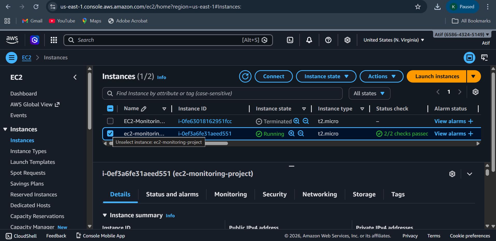
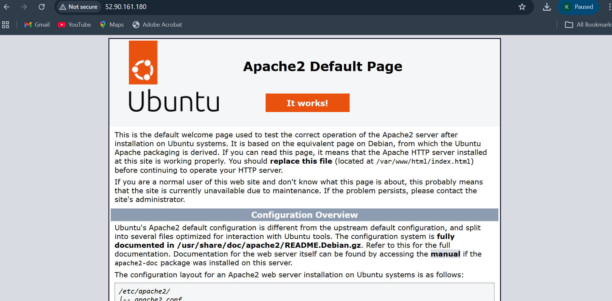
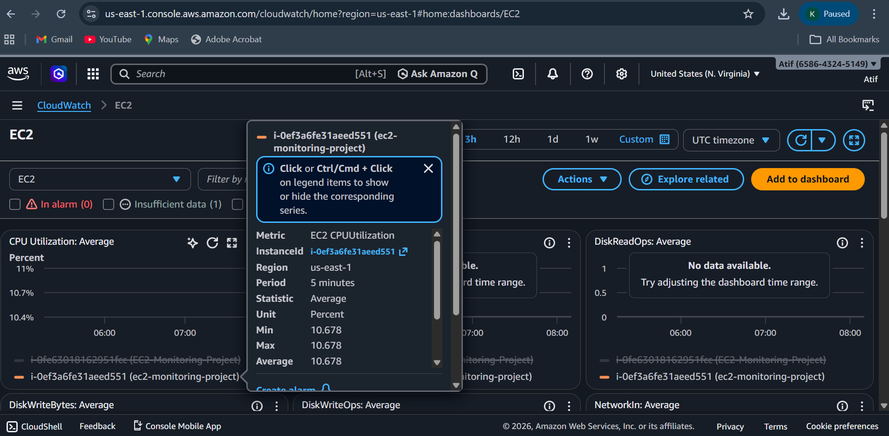
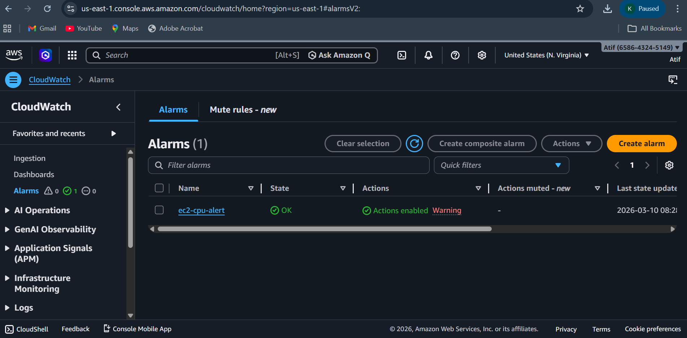

# AWS EC2 Monitoring Project

## Project Overview
This project demonstrates how to deploy and monitor a Linux web server on the cloud using Amazon EC2 and Amazon CloudWatch in Amazon Web Services (AWS).

In this project, I launched an EC2 instance, installed a web server, and monitored server performance using CloudWatch metrics and alarms.
## Architecture

User Browser  
↓  
EC2 Instance (Ubuntu Linux)  
↓  
Apache Web Server  
↓  
CloudWatch Monitoring (CPU Metrics & Alerts)

## Tools & Technologies Used

- Amazon Web Services (AWS)
- Amazon EC2
- Amazon CloudWatch
- Ubuntu Linux
- Apache HTTP Server
- SSH
**
## Project Steps

### 1. Launch EC2 Instance

- Created EC2 instance using Ubuntu AMI
- Selected instance type **t2.micro (Free Tier)**
- Configured security group to allow **SSH (22)** and **HTTP (80)**

### 2. Connect to EC2 Instance

Connected to the server using SSH.

Example command:
ssh -i key.pem ubuntu@public-ip

### 3. Install Apache Web Server
Updated packages and installed Apache.
   sudo apt update
   sudo apt install apache2 -y

Started the service:
   sudo systemctl start apache2

### 4. Access Website
Opened the EC2 public IP in the browser.
 example: http://public-ip
 
Apache default page confirmed that the web server is running successfully.

### 5. Monitor EC2 Using CloudWatch

Used Amazon CloudWatch to monitor instance performance.
Metrics monitored:

- CPU Utilization
- Network In/Out
- Disk Read/Write

### 6. Create CloudWatch Alarm

Configured an alarm to monitor CPU utilization.

Example condition:
CPU Utilization > 80%

CloudWatch sends alerts when CPU usage crosses the threshold.

## Screenshots

### EC2 Instance Running

### Apache Web Server

### CloudWatch Metrics

### CloudWatch Alarm

## Key Learning Outcomes
From this project I learned:

- Launching and configuring EC2 instances
- Connecting to Linux servers using SSH
- Installing and managing Apache web servers
- Monitoring cloud resources using CloudWatch
- Creating alerts for infrastructure monitoring

## Future Improvements

- Add Auto Scaling
- Add Load Balancer
- Deploy a real website instead of Apache default page
- Implement log monitoring

## Author

Name: Atif  
Role: Cloud Support Engineer Aspirant

   
   

